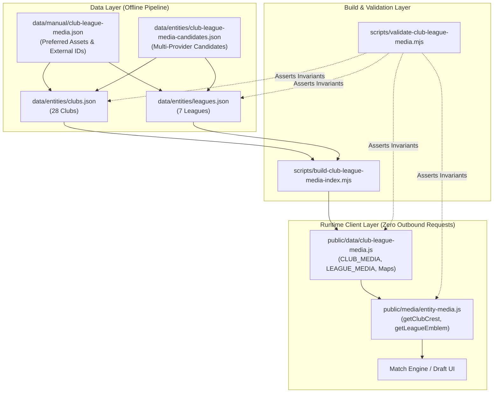

# Club & League Media Foundation v1

This document specifies the architectural foundation, schema definitions, multi-provider discovery pipeline, HTTP and magic-byte asset validation, deterministic scoring algorithm, runtime helpers, licensing policy, and validation suite for **Club & League Media v1**.

---

## 1. Architectural Principles & Scope

### 1.1 Strict Separation of Concerns
The match simulation engine (`public/` and `server/`) requires visual brand identity (club crests and competition emblems) for UI cards and scoreboard headers without polluting core gameplay logic or introducing runtime network latency:



### 1.2 Scope Boundaries
- **In Scope**: The 28 Club Entities in `data/entities/clubs.json` and 7 League Entities in `data/entities/leagues.json` (35 entities total).
- **Out of Scope**: Player media (`data/entities/players.json`, `data/entities/player-media-candidates.json`), gameplay balance ratings, bot logic, draft state machines, match engine calculations, and network socket semantics.
- **Zero Binary Commits**: No raw `.png`, `.webp`, `.jpg`, or `.svg` files are committed to version control. Media assets are referenced via verified HTTPS URLs.

---

## 2. Schema Specifications

### 2.1 Club Entity Media Model (`data/entities/clubs.json`)
Each club record maintains verified external IDs, the preferred crest object, and ranked candidate alternatives:

```json
{
  "id": "arsenal",
  "canonicalName": "Arsenal",
  "league": "Premier League",
  "leagueId": "premier-league",
  "localizedNames": {
    "en": "Arsenal",
    "zh-CN": "阿森纳",
    "ja": "アーセナル"
  },
  "externalIds": {
    "footballData": 57,
    "theSportsDb": 133604,
    "wikidata": "Q9617",
    "fifaIndexTeamId": 1
  },
  "media": {
    "crest": {
      "provider": "fifaindex",
      "source": "fifaindex-fc27",
      "url": "https://images.fifaindex.com/fc27/teams/1.webp",
      "sourcePageUrl": "https://www.fifaindex.com/team/1/arsenal/",
      "mimeType": "image/webp",
      "width": 256,
      "height": 256,
      "transparent": true,
      "status": "reachable",
      "licenseStatus": "external-provider"
    },
    "crestCandidates": [
      {
        "entityId": "arsenal",
        "mediaType": "club-crest",
        "provider": "fifaindex",
        "source": "fifaindex-fc27",
        "url": "https://images.fifaindex.com/fc27/teams/1.webp",
        "httpStatus": 200,
        "mimeType": "image/webp",
        "width": 256,
        "height": 256,
        "transparent": true,
        "status": "reachable",
        "reachable": true,
        "placeholder": false,
        "identityConfidence": "high",
        "licenseStatus": "external-provider",
        "score": 105
      }
    ]
  }
}
```

### 2.2 League Entity Media Model (`data/entities/leagues.json`)
Each competition record contains competition external identifiers, the preferred competition emblem, and emblem candidates:

```json
{
  "id": "premier-league",
  "canonicalName": "Premier League",
  "localizedNames": {
    "en": "Premier League",
    "zh-CN": "英超",
    "ja": "プレミアリーグ"
  },
  "externalIds": {
    "footballData": "PL",
    "theSportsDb": 4328,
    "wikidata": "Q9448",
    "fifaIndexLeagueId": 13
  },
  "media": {
    "emblem": {
      "provider": "fifaindex",
      "source": "fifaindex-fc27",
      "url": "https://images.fifaindex.com/fc27/leagues/13.webp",
      "sourcePageUrl": "https://www.fifaindex.com/leagues/13-england-premier-league-1/",
      "mimeType": "image/webp",
      "width": 256,
      "height": 256,
      "transparent": true,
      "status": "reachable",
      "licenseStatus": "external-provider"
    },
    "emblemCandidates": [ ... ]
  }
}
```

### 2.3 Manual Sidecar (`data/manual/club-league-media.json`)
Stores human/pipeline-audited selections and external IDs without redundant canonical names:

```json
{
  "schemaVersion": "1.0.0",
  "clubs": {
    "arsenal": {
      "externalIds": {
        "footballData": 57,
        "theSportsDb": 133604,
        "wikidata": "Q9617",
        "fifaIndexTeamId": 1
      },
      "preferred": {
        "provider": "fifaindex",
        "source": "fifaindex-fc27",
        "url": "https://images.fifaindex.com/fc27/teams/1.webp",
        "sourcePageUrl": "https://www.fifaindex.com/team/1/arsenal/",
        "mimeType": "image/webp",
        "width": 256,
        "height": 256,
        "transparent": true,
        "status": "reachable",
        "licenseStatus": "external-provider"
      }
    }
  },
  "leagues": { ... }
}
```

---

## 3. Multi-Provider Discovery Architecture

The pipeline integrates multiple independent providers to guarantee 100% reachable coverage and rich fallbacks across all 35 entities:

| Priority | Provider | Source Enum | Asset Formats | Role & Policy |
| :---: | :--- | :--- | :--- | :--- |
| **#1** | **FIFAIndex Current** | `fifaindex-fc27` | High-res WebP (256x256) | Primary modern provider. Verified against FIFAIndex team and league directory pages. Selected for all licensed teams. |
| **#2** | **football-data.org** | `football-data-crests` | Official SVG vectors & PNG | Vector fallback. Selected as preferred for Serie A clubs unlicensed in EA FC. |
| **#3** | **Wikidata / Wikipedia** | `wikidata-p154`, `wikipedia-infobox` | SVG / PNG | Semantic knowledge-graph fallback. High resolution and canonical infobox provenance. |
| **#4** | **Wikimedia Commons** | `commons-api` | Vector SVG | Open-source community archive. Subject to strict anti-confusion filtering. |
| **#5** | **TheSportsDB** | `thesportsdb-badges` | High-res PNG (512x512) | Aesthetic badges for comparison and visual redundancy. |

### 3.1 Handling Unlicensed EA FC Serie A Badges
In EA Sports FC (FC 25 / FC 27), four Italian Serie A clubs are unlicensed and assigned generic fictional shields by EA:
- `ac-milan` (`131681`, Milano FC)
- `inter-milan` (`131682`, Lombardia FC / generic shield)
- `atalanta` (`115845`, Bergamo Calcio / generic shield)
- `lazio` (`115841`, Latium / generic shield)

The pipeline explicitly flags these assets as `unlicensedBadge: true`. While they remain recorded in `crestCandidates`, the scoring engine penalizes them so that authentic vector SVG crests from football-data.org or Wikimedia Commons are automatically selected as preferred.

---

## 4. HTTP Validation, Magic-Byte Sniffing & Anti-Placeholder Pipeline

Every discovered URL is validated via real HTTP network execution in `scripts/media/club-league-http.mjs`:

### 4.1 Transport & Networking
- **IPv4 Priority**: `dns.setDefaultResultOrder('ipv4first')` eliminates dual-stack connection delays on Windows.
- **HTTP/2 Transport**: Automatic HTTP/2 multiplexing for `images.fifaindex.com`.
- **User-Agent Compliance**: Uses `BattleBaseMediaAudit/1.0 (https://github.com/2505059-dot/battle-base)`, adhering strictly to Wikimedia Foundation crawler policies.
- **Concurrency & Rate Limiting**: Max concurrency 5 with per-host backoff intervals (200–250ms).

### 4.2 Magic Byte & Format Verification
To ensure no corrupted responses, HTML error pages, or truncated assets are accepted:
- **PNG**: Asserts 8-byte signature `89 50 4E 47 0D 0A 1A 0A`. Reads `IHDR` width, height, and color type. Evaluates `tRNS` chunks for indexed transparency.
- **JPEG**: Asserts signature `FF D8 FF`. Scans SOF markers (SOF0..SOF15) to parse frame dimensions. Marks `transparent: false`.
- **WebP**: Asserts `RIFF....WEBP`. Parses `VP8X`, `VP8L`, and `VP8 ` chunk headers for canvas width, height, and alpha bits.
- **SVG**: Checks MIME type `image/svg+xml`. Verifies body contains `<svg` and does not contain `<!DOCTYPE html` or `<html`. Parses `width`, `height`, and `viewBox`. Marks `transparent: true`.

### 4.3 Anti-Placeholder Sniffing
Detects generic or broken placeholders containing `placeholder`, `no-image`, `notfound`, `default-logo`, `blank`, `1x1`, or `spacer` in URL paths or metadata, as well as 1x1 single-pixel images. All placeholders receive `placeholder: true` and a score of 0, excluding them from preferred selection.

---

## 5. Deterministic Candidate Scoring Algorithm

Candidate selection is fully deterministic and bitwise reproducible:

```
Score = Base (50)
      + 45 (if fifaindex-fc27 AND licensed)
      - 35 (if fifaindex-fc27 AND unlicensedBadge)
      + 25 (if vector image/svg+xml)
      + 15 (if image/webp)
      + 12 (if image/png)
      + 10 (if football-data provider)
      +  8 (if wikimedia-commons / wikipedia)
      +  6 (if thesportsdb)
      +  5 (if transparent alpha verified)
      +  5 (if width >= 128 and height >= 128)
      - 20 (if aspect ratio < 0.25 or > 4.0)
      - 15 (if dimension < 64px)
```

Unreachable candidates, HTTP errors, and detected placeholders receive `score = 0`. Candidates are sorted by `score DESC`, then `provider ASC`, then `url ASC`.

---

## 6. Runtime Integration & Helper Architecture

### 6.1 Static Runtime Index (`public/data/club-league-media.js`)
Builds a frozen JavaScript module containing only clean preferred metadata:

```javascript
import { CLUB_MEDIA, LEAGUE_MEDIA } from '../data/club-league-media.js';
```

### 6.2 Safe Client Helper API (`public/media/entity-media.js`)
Provides resilient lookup functions that accept either canonical entity names or entity slug IDs and never throw:

```javascript
import { getClubCrest, getLeagueEmblem } from '../media/entity-media.js';

// By canonical name:
getClubCrest('Arsenal');
// -> { url: "https://images.fifaindex.com/fc27/teams/1.webp", provider: "fifaindex", licenseStatus: "external-provider" }

// By entity slug ID:
getClubCrest('arsenal');
// -> { url: "https://images.fifaindex.com/fc27/teams/1.webp", provider: "fifaindex", licenseStatus: "external-provider" }

// Competitions:
getLeagueEmblem('Premier League');
getLeagueEmblem('premier-league');

// Safe null fallbacks:
getClubCrest(null);                 // -> null
getClubCrest('Unknown Club');       // -> null
```

---

## 7. Licensing Policy & Trademark Classifications

Club crests and league emblems represent registered trademarks owned by football clubs, leagues, and associations:

| `licenseStatus` | Classification & Scope |
| :--- | :--- |
| `external-provider` | Hosted by official game providers (FIFAIndex / EA Sports), sports databases (football-data.org), or fan archives under fair use / editorial reporting terms. Registered trademarks of respective entities. |
| `verified-free` | Public domain or Creative Commons assets without trademark encumbrances. |
| `unknown` | Unverified provenance (strictly disallowed in production indexes). |

All 35 entity media records carry the `external-provider` status.

---

## 8. Validation, Reproducibility & Offline Verification Tooling

The foundation provides complete reproducibility and offline verification:

```bash
# 1. Audit and discover Club & League media (validates HTTP, parses magic bytes)
node scripts/audit-club-league-media.mjs

# 2. Build deterministic entity indexes
node scripts/build-entity-index.mjs --skip-player-audit

# 3. Build runtime media index for client consumption
node scripts/build-club-league-media-index.mjs

# 4. Run full entity foundation validation suite
node scripts/validate-entities.mjs

# 5. Run dedicated Club & League media validation suite
node scripts/validate-club-league-media.mjs
```

### 8.1 Invariant Guarantees
- Exactly 28 clubs and 7 leagues present.
- 100% preferred reachability with verified HTTPS protocols and image MIME types.
- 0 duplicate preferred URLs across all 35 entities.
- Zero timestamps or non-deterministic properties in generated JSON sidecars and Markdown reports.
