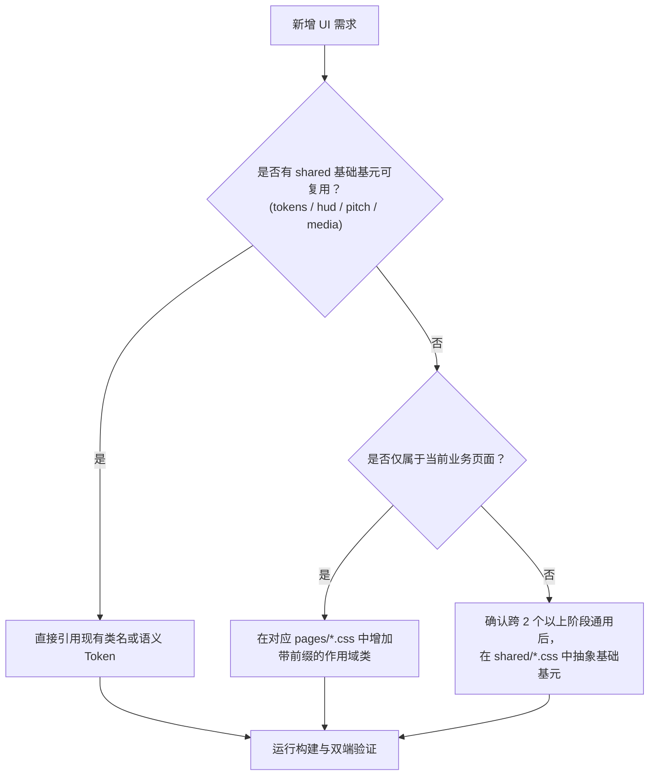

# CSS 架构规范与维护指南 (CSS Architecture & Guidelines)

本文档定义了 Battle Base 项目的模块化 CSS 架构、级联层（Cascade Layers）组织、命名规范、样式隔离准则与后续开发工作流。

---

## 1. 目录结构与文件职责 (Module Structure & Responsibilities)

### 1.1 文件结构概览

```
public/
├── style.css                      # 历史遗留全量样式 (~2,245 行)，完整打包进 @layer legacy
└── styles/
    ├── app.src.css                # 唯一编译入口源码（定义图层、导入模块与 @source 扫描路径）
    ├── app.css                    # 最终编译产物 (~110KB，由 npm run build:css 生成，严禁手动修改)
    ├── theme/
    │   └── tokens.css             # UI Foundation v1 语义设计 Token (@theme + :root CSS 变量)
    ├── shared/
    │   ├── base.css               # 基础作用域重置 (.ui-scope)、通用卡片槽位与基础动效
    │   ├── shell.css              # 全局夜间球场背景、body 容器宽度与 in-game 顶层外壳
    │   ├── hud.css                # 顶部导航栏 (.topbar)、Toast、基础控制面板与右侧检查器骨架
    │   ├── media.css              # 跨阶段共享的媒体卡片、赛季标签 (.ol3-season-badge) 与位置标识
    │   └── pitch.css              # 跨阶段共享的球场空槽标记、figure 包装容器与角色插槽类
    └── pages/
        ├── lobby.css              # 大厅首页外壳 (#lobby.bb-lobby-shell) 与创建/加入表单卡片
        ├── room.css               # 等待房间面板 (#room.bb-room-shell) 与玩家名单网格
        ├── draft.css              # 选人工作台 (Draft Workbench 3 列桌面 / 3 Tab 移动端)
        ├── reveal.css             # 阵容揭晓视图 (REVEAL 阶段 22 人对比 / 11 人单队视角)
        └── match.css              # 比赛中心与结算视图 (MATCH / RESULT 阶段记分牌与两侧小球场)
```

### 1.2 显式级联层级 (Cascade Layer Order)

在 `public/styles/app.src.css` 顶部唯一定义了显式图层顺序：

```css
@layer theme, legacy, components, utilities;
```

各层职责与优先级（从低到高）：
1. **`theme`**: Tailwind 核心变量与 `theme/tokens.css` 中的语义设计变量（颜色、间距、圆角、字阶、阴影、z-index）。
2. **`legacy`**: `public/style.css` 原样导入至该层。所有老代码的全局规则天然处于低优先级，无需使用 `!important` 即可被后续组件覆盖。
3. **`components`**: 所有重构后的模块化样式（`shared/*` 与 `pages/*`）。所有自定义组件、工作台布局与战术球场表现均在此层内解析。
4. **`utilities`**: Tailwind 原子工具类层（`@import "tailwindcss/utilities.css"`）。任何写在 HTML/JS 模版中的工具类均可稳定覆盖老代码规则。

> [!IMPORTANT]
> **关于 `@source` 扫描指令**：
> Tailwind CSS v4 依赖 `@source` 指令发现 HTML/JS 模板中的工具类。所有 `@source` 必须严格保留在顶层入口 `public/styles/app.src.css` 中，禁止下放或分散到各子模块文件中。

### 1.3 规划中功能路线图的文件归属映射 (Roadmap Mapping)

| 即将开发的功能模块 | 归属样式文件 | 说明与原则 |
| :--- | :--- | :--- |
| **新产品首页 / 房间列表大厅** | `public/styles/pages/lobby.css` | 房间筛选器、大厅列表卡片、新手引导入口均写在 `lobby.css` 中 |
| **房间内部设置 / 准备区 UI** | `public/styles/pages/room.css` | 房间规则配置、房主特权操作、等待位准备态样式写在 `room.css` 中 |
| **Draft 选人台细节修复 / 交互增强** | `public/styles/pages/draft.css` | 候选卡高亮、位置槽位占位、确认抽签条动画等 Draft 专属逻辑 |
| **REVEAL 揭晓阶段视觉微调** | `public/styles/pages/reveal.css` | 揭晓卡牌翻转、22 人同屏对位高亮属于 Reveal 阶段专用样式 |
| **MATCH Center v2 / 2D 比赛可视化** | `public/styles/pages/match.css` | 全新 2D 比赛引擎、实时时间轴、射门事件气泡写在 `match.css` 中；**仅当球场标记元素确定在 Draft/Reveal/Match 三方共用时**，才提升至 `shared/pitch.css` |

---

## 2. 命名规范 (Naming Conventions)

项目中存在不同迭代历史引入的类名，为保持清晰的边界，后续开发必须严格遵守以下类名前缀：

| 前缀 | 适用领域 | 示例 | 规范说明 |
| :--- | :--- | :--- | :--- |
| `bb-*` | 全局产品外壳 / 大厅 / 房间 | `.bb-theme`, `.bb-lobby-shell`, `.bb-btn-primary`, `.bb-room-player` | Battle Base 产品级基础框架，语义明确，不与足球游戏内部逻辑混淆。 |
| `dw-*` | Draft Workbench (选人工作台) | `.dw-workbench`, `.dw-candidate-card`, `.dw-squad-panel`, `.dw-inspector` | 选人工作台所有 3 列布局、卡片、操作条均以 `dw-` 开头。（注：历史遗留的 `.dw-inspector*` 检查器基础骨架目前与 Reveal 共享）。 |
| `rv-*` | REVEAL (揭晓阶段) | `.rv-root`, `.rv-full-pitch-stage`, `.rv-single-stage`, `.rv-node` | 选人完成后的阵容展示与对阵揭晓专用样式。 |
| `mc-*` | **MATCH Center v2 (推荐新前缀)** | `.mc-stage`, `.mc-timeline`, `.mc-canvas-2d`, `.mc-event-popup` | **强烈建议**：未来开发的 Match Center v2 与 2D 比赛可视化统一使用 `mc-`，彻底隔离于老版 `fd-match-*`。 |
| `fd-*` | 足球核心领域共享 / 遗留基础类 | `.fd-header`, `.fd-team-panel`, `.fd-log`, `.fd-pitch-figure` | 现有业务核心标签。**维护原则**：禁止对其增加宽泛的无作用域全局覆盖，若要在单阶段修改必须增加阶段父级限定。 |
| `ol3-*` | 战术视觉表现辅助工具类 | `.ol3-pitch`, `.ol3-season-badge`, `.ol3-pos-tag--fw`, `.ol3-line-bars` | 继承自 FO3/3M 战术排版辅助类。后续新功能应逐步向语义化 Token 或模块类靠拢，保持现有类稳定，不进行无意义的大规模重命名。 |

---

## 3. 样式隔离规则与已知跨模块依赖 (Style Isolation Rules & Known Cross-Module Dependencies)

### 3.1 核心隔离规则

1. **单页面专用样式绝不下沉**：
   - 属于 Draft 的专属布局只能留在 `pages/draft.css`。
   - 属于 Match 的记分牌和队伍对比只能留在 `pages/match.css`。
   - `shared/*.css` 必须且仅允许存放**跨 2 个或以上独立业务阶段实际复用**的视觉基元。
2. **严禁无限定全局覆写**：
   - 绝对不要为了某个阶段的效果在全局直接重写 `.fd-team-panel`、`.fd-header` 或 `button`。
   - 必须通过页面根节点进行作用域收敛：
     - Draft 阶段：`body.in-draft .dw-root ...` 或 `.dw-workbench ...`
     - Reveal 阶段：`body.in-reveal .rv-root ...` 或 `.rv-single-stage ...`
     - Match 阶段：`body.in-match .fd-match-zone ...`
3. **避免冗余 `:not(...)` 链**：
   - 优先使用阶段根类（如 `body.in-draft`）限定作用域，而非在全局规则上追加 `:not(.in-draft):not(.in-match):not(...)`。

### 3.2 已知跨模块级联顺序依赖 (Documented Cross-Module Cascade Dependencies)

在当前 CSS 架构中，以下选择器存在相同特异性（same-specificity）或继承依赖，**模块导入顺序不得颠倒**：

1. **`.fd-header` vs `.dw-header--draft`**：
   - `shared/hud.css` 定义了基础 `.fd-header`。
   - `pages/draft.css` 定义了紧凑单行网格 `.dw-header--draft`。
   - 依赖关系：`shared/hud.css` 必须先于 `pages/draft.css` 导入，确保 Draft 紧凑头部生效。
2. **`.fd-team-panel:not(.ol3-pitch-stage-panel)` vs `.dw-root .dw-inspector`**：
   - `shared/hud.css` 为非舞台面板设置了通用的渐变与内边距。
   - `pages/draft.css` 中的 `.dw-inspector` 对其进行了透明化与高度 100% 弹性拉伸。
   - 依赖关系：`shared/hud.css` 必须先加载。
3. **`.dw-inspector-head` vs `.rv-inspector-head`**：
   - `shared/hud.css` 定义了右侧球员检查器的基础头部结构。
   - `pages/reveal.css` 在揭晓阶段复用了部分 `.dw-inspector*` 结构，并通过 `.rv-inspector-head` 进行了自适应微调。
4. **`.fd-log` vs 阶段历史记录面板**：
   - `shared/hud.css` 定义了基础 `.fd-log` 边框与暗色背景。
   - `pages/draft.css`（`.dw-center .fd-history`）与 `pages/reveal.css`（`.rv-history-box.fd-log`）在同特异性下重置了滚动条与圆角。
5. **剪影球星卡评分居中顺序 (Silhouette OVR Centering Rules)**：
   - 在 `draft.css`、`reveal.css` 与 `match.css` 中，默认球员评分 `.fd-pitch-rating` 位于右下角偏移（`right: -4px; bottom: -2px;`）。
   - 当遇到无头像剪影卡（`:has(.fd-pitch-avatar--silhouette)` / `:has(.fd-player-img--silhouette)`）时，评分必须全屏居中覆盖（`inset: 0; display: flex; align-items: center; justify-content: center;`）。
   - **重要顺序约束**：居中规则必须严格写在普通 `.fd-pitch-rating` 规则**之后**，否则右下角定位会再次覆盖居中定位。
6. **无障碍动效重置 (`@media (prefers-reduced-motion: reduce)`)**：
   - 放置在对应模块的最底部，确保在操作系统开启减弱动画时，能强制覆盖上方所有过渡属性。

---

## 4. 后续开发工作流 (Development Workflow)

当在项目中开发新 UI 页面或进行界面迭代时，遵循以下工程标准：

### 4.1 四步思考原则



- **第一步：先复用 shared**：查看 `theme/tokens.css` 中的语义颜色与 `shared/*.css` 中的卡片/徽章/球场插槽基元。
- **第二步：再新增页面样式**：若为当前页面特有交互或排版，在 `pages/<page>.css` 中以对应前缀（`bb-`, `dw-`, `rv-`, `mc-`）新增样式规则。
- **第三步：最后考虑修改全局基础**：不到万不得已，不要改动 `shared/shell.css` 或 `public/style.css`；若必须修改，评估是否会对其他阶段产生回归。
- **严禁向 `app.src.css` 追加行内样式规则**：`app.src.css` 仅作为声明层级与模块导入的清单，不可在此文件中写业务 CSS。

### 4.2 本地构建与验证清单 (Verification Checklist)

提交任何样式代码前，必须依序执行以下三步检查：

```bash
# 1. 编译打包 CSS
npm run build

# 2. 运行选人台与媒体 UI 自动化 Smoke 测试（确保 DOM 逻辑与样式类绑定正常）
node scripts/smoke-draft-workbench.mjs
node scripts/smoke-player-media-ui.mjs
node scripts/smoke-concurrent-draft.mjs
```

#### 双端布局检查要点：
- **桌面端 (1366 × 768)**：视口高度内单屏完整容纳，无外层主滚动条，左中右三列无横向溢出。
- **移动端 (390 × 844)**：页面必须支持 Tab 切换，任何元素不得超出 `390px` 产生横向滚动晃动。
