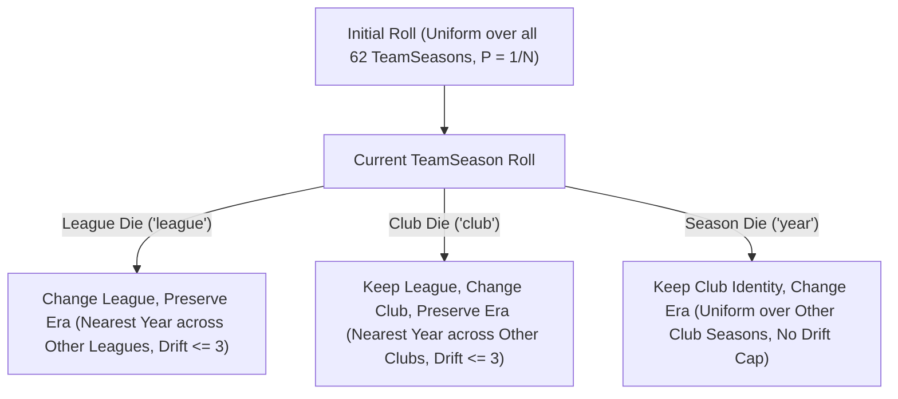

# Draft Roll Policy v2 Architecture Specification

- **Policy Version**: \`DRAFT_ROLL_POLICY_VERSION = "teamseason-semantic-v2"\`
- **Single Source of Truth**: [\`public/game/roll-policy.js\`](file:///c:/Users/room202/Desktop/battle-base/public/game/roll-policy.js)
- **Status**: Production Reference & Shared Engine Contract

---

## 1. Overview & Motivation

Draft Roll Policy v1 generated team seasons using a hierarchical uniform selection:
$$\text{League uniform} \rightarrow \text{Club uniform within League} \rightarrow \text{Year uniform within Club}$$

While conceptually simple, this caused extreme probability distortions:
1. **Isolated Club Bias**: Single-club leagues or small leagues yielded outsized probabilities. For instance, **FC Porto 2004** and **SL Benfica 2014** had an initial roll probability of $1 / (7 \times 2 \times 1) = 1/14 \approx 7.14\%$.
2. **Dense Club Starvation**: Renowned clubs with extensive historical coverage in large leagues were heavily diluted. For instance, **Real Madrid 2002** had a probability of $1 / (7 \times 5 \times 5) = 1/175 \approx 0.57\%$, and **Manchester United 2008** was $1 / (7 \times 6 \times 4) = 1/168 \approx 0.60\%$.
3. **Severe Variance Ratio**: The ratio between the highest and lowest probability was **16.0x**, causing repetitive player pools and skewing draft meta-balance.

**Draft Roll Policy v2** solves this by establishing:
- **Uniform Initial TeamSeason Rolls** ($P = 1/N \approx 1.61\%$ for every team season).
- **Semantically Coherent Reroll Dice** with era-preservation drift caps ($\le 3$ years) and hierarchical fairness across eligible targets.
- **Strict Shared Engine Contract** across all gameplay modes.

---

## 2. Shared Engine Contract

A single canonical implementation exists at [\`public/game/roll-policy.js\`](file:///c:/Users/room202/Desktop/battle-base/public/game/roll-policy.js).

All current and future game modes share this exact module:
- **Quick Duel (1v1 Human Concurrent Blind Draft)**: Used in [\`public/game/controller.js\`](file:///c:/Users/room202/Desktop/battle-base/public/game/controller.js), [\`public/game/draft/rules.js\`](file:///c:/Users/room202/Desktop/battle-base/public/game/draft/rules.js), and [\`public/game/draft/transitions.js\`](file:///c:/Users/room202/Desktop/battle-base/public/game/draft/transitions.js).
- **Play vs Bot (AI Decision Engine & Headless Simulators)**: Used in [\`public/game/bot/reroll-value.js\`](file:///c:/Users/room202/Desktop/battle-base/public/game/bot/reroll-value.js) and [\`public/game/bot/decision.js\`](file:///c:/Users/room202/Desktop/battle-base/public/game/bot/decision.js).
- **Future Golden Run (Roguelite / Single-Player Draft Runs)**: Golden Run **must never** duplicate league, club, or season probability trees or legality logic. It **must import directly** from \`public/game/roll-policy.js\`.

Any transition not permitted by \`isLegalRerollDestination(prevRoll, nextRoll, rerollType)\` is rejected by the engine state machine with reason code \`invalid_reroll_transition\`.

---

## 3. Semantic Definitions of Initial Roll & Reroll Dice

### 3.1 Initial Roll (\`generateInitialRollTeamSeason\`)
- **Semantics**: Balanced uniform draw over all $N = 62$ team seasons.
- **Probability**:
  $$P(\text{TeamSeason}_i) = \frac{1}{N} = \frac{1}{62} \approx 0.01612903 \quad (1.612903\%)$$
- **Guarantees**:
  - `porto-2004`, `benfica-2014`, `monaco-2017`, `ajax-2019`, `real-madrid-2002`, and `manchester-united-2008` have identical initial probability.
  - Max/min ratio is exactly **1.0**.

### 3.2 League Die (\`rerollType === 'league'\`)
- **Semantics**: Change league, preserve era/temporal context as closely as possible.
- **Eligibility**:
  1. Target must be from an **other league** (`league !== currentRoll.league`).
  2. For each other league, find the minimum year difference to `currentRoll.year`.
  3. Compute the **global minimum distance** $d_{\min} = \min_{L \ne L_{\text{curr}}} |year_L - year_{\text{curr}}|$.
  4. If $d_{\min} > 3$ (`LEAGUE_REROLL_MAX_YEAR_DRIFT = 3`), the League Die is disabled (`available: false`, returns `[]`).
  5. Only other leagues that achieve $d_{\min}$ are eligible.
- **Hierarchical Fairness Rule**:
  - Each eligible target league receives an equal share: $P(\text{League}) = 1 / |\text{EligibleLeagues}|$.
  - Within each eligible league, if both $year_{\text{curr}} - d_{\min}$ and $year_{\text{curr}} + d_{\min}$ exist, probability is split equally across eligible years: $P(\text{Year} \mid \text{League}) = P(\text{League}) / |\text{EligibleYears}|$.
  - Within each eligible year, probability is split equally across all TeamSeasons: $P(\text{TeamSeason}) = P(\text{Year}) / |\text{SeasonsInYear}|$.
- **Empirical Status**:
  - Exact same year ($d_{\min} = 0$): 55 / 62 (88.71%).
  - Within $\pm 1$ year ($d_{\min} \le 1$): 62 / 62 (100.00%).
  - Max observed fallback distance: 1 year across the entire dataset. League Die is 100% available for all 62 TeamSeasons.

### 3.3 Club Die (\`rerollType === 'club'\`)
- **Semantics**: Keep current league, change club, preserve era as closely as possible.
- **Eligibility**:
  1. Target must be from the **same league** (`league === currentRoll.league`) and **different club** (`club !== currentRoll.club`).
  2. For each other club in the league, find the minimum year difference to `currentRoll.year`.
  3. Compute the **global minimum distance** $d_{\min} = \min_{C \ne C_{\text{curr}}} |year_C - year_{\text{curr}}|$.
  4. If no other club exists in the league OR $d_{\min} > 3$ (`CLUB_REROLL_MAX_YEAR_DRIFT = 3`), the Club Die is disabled (`available: false`, returns `[]`).
  5. Only other clubs in the same league that achieve $d_{\min}$ are eligible.
- **Hierarchical Fairness Rule**:
  - Each eligible target club receives an equal share: $P(\text{Club}) = 1 / |\text{EligibleClubs}|$.
  - Within each eligible club, probability is split equally across eligible nearest years, and then across TeamSeasons in that year.
- **Empirical Status**:
  - Exact same year ($d_{\min} = 0$): 16 / 62 (25.81%).
  - Within $\pm 1$ year: 44 / 62 (70.97%).
  - Within $\pm 2$ years: 50 / 62 (80.65%).
  - Within $\pm 3$ years: 54 / 62 (87.10%).
  - **Unavailable ($d_{\min} > 3$)**: 8 / 62 (12.90%). The 8 team seasons are `manchester-united-1999` (5y), `bayern-munich-2001` (12y), `monaco-2017` (4y), `lille-2021` (4y), `ajax-2019` (14y), `psv-2005` (14y), `porto-2004` (10y), `benfica-2014` (10y).
  - On these 8 team seasons, the Club Reroll button is disabled and UI renders an explanatory hint (`* No other same-league clubs are available near {year}, so Club Reroll is disabled`).

### 3.4 Season Die (\`rerollType === 'year'\`)
- **Semantics**: Change era/season while strictly preserving club identity.
- **Eligibility**:
  - Must be from the **same club** (`club === currentRoll.club`) and **different year** (`year !== currentRoll.year`).
  - Evaluated by club name string, making it immune to historical league restructuring.
  - **No $\pm 3$ year cap**: A player drafting Real Madrid 2022 can reroll to Real Madrid 2002 (20-year jump).
  - Uniform probability: Each other season year of that club receives $P = 1 / (\text{TotalClubSeasons} - 1)$.
- **Empirical Status**:
  - Available: 46 / 62 (74.19%).
  - Unavailable (Single-Season Clubs): 16 / 62 (25.81%). Disabled with UI hint (`* No other season years are available for {club}, so Year Reroll is disabled`).

---

## 4. Determinism & RNG Consumption Rules

1. **Deterministic Distribution Ordering**:
   - `getInitialRollOutcomeDistribution()` and `getRerollOutcomeDistribution(currentRoll, rerollType)` return arrays sorted strictly ascending by `TEAM_SEASONS` dataset index.
   - Ordering is invariant to iteration order, runtime platform, or locale.
2. **Zero RNG Consumption on Distribution Construction**:
   - Calling `getInitialRollOutcomeDistribution()` or `getRerollOutcomeDistribution()` consumes **0 RNG calls**.
   - Distributions are memoized and safe to evaluate repeatedly (e.g., in bot search trees, EV evaluation, and UI render loops).
3. **Exact RNG Consumption on Sampling**:
   - `sampleOutcomeDistribution(distribution, randomFn)` consumes `randomFn` **exactly 1 time** if `distribution.length > 0`, and **0 times** if distribution is empty.
   - Cumulative interval testing:
     $$\text{target} = r \times \sum P_i \quad \text{where } r = \text{clamp}(rng(), 0, 0.999999999999)$$
   - Floating-point safe: normalized sum and boundary fallthrough to last valid team season ensures zero out-of-bounds errors.
4. **Network Verification & Anti-Cheat**:
   - Client sends `{ kind: 'reroll', type, teamSeasonId }`.
   - Controller verifies `isValidRerollTransition(currentRoll, targetTeamSeason, type)`.
   - Any unlisted team season or distance violation is rejected instantly without consuming reroll tokens.
