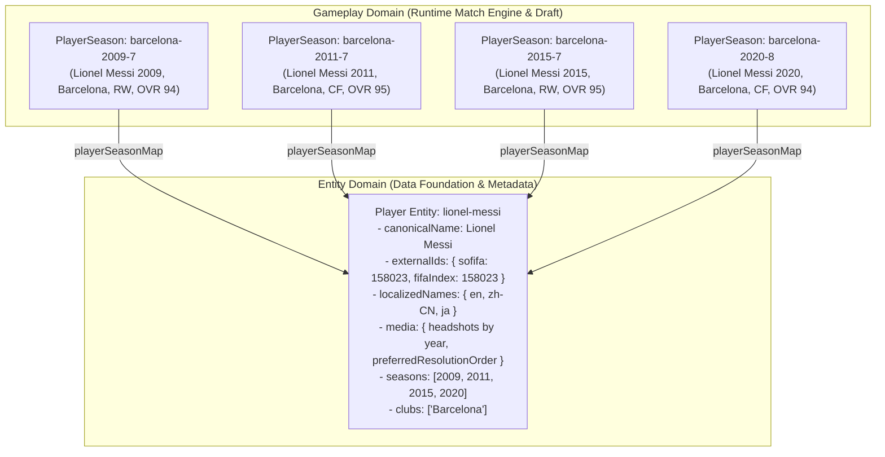
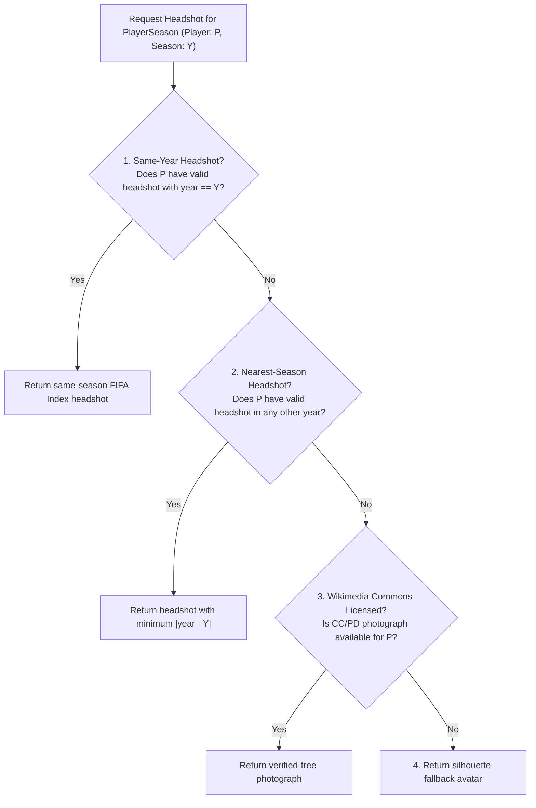

# Football Entity & Media Foundation v1

This document specifies the architectural foundation, schema definitions, identification models, media resolution algorithms, external provider audits, licensing classifications, and offline pipeline tooling for **Football Entity & Media Foundation v1**.

---

## 1. Architectural Principles & Separation of Concerns

### 1.1 The Fundamental Separation: `PlayerSeason` vs `Player Entity`

In the match simulation and draft gameplay engine, player cards represent a historical athlete in a specific season at a specific club (e.g. *Cristiano Ronaldo at Manchester United in 2008* vs *Cristiano Ronaldo at Real Madrid in 2017*).

The foundation establishes a strict architectural boundary between **gameplay instances** and **canonical entities**:



| Dimension | `PlayerSeason` (Gameplay Instance) | `Player Entity` (Canonical Identity) |
| :--- | :--- | :--- |
| **Location** | `public/data/team-seasons.js` | `data/entities/players.json` |
| **Cardinality** | 554 records | 418 records |
| **Primary Key** | Slug + Index (e.g. `barcelona-2009-7`) | Canonical Slug (e.g. `lionel-messi`) |
| **Scope** | Single season, single roster, tactical role | Complete historical athlete career in dataset |
| **Attributes** | `overall`, `attack`, `creation`, `defense`, `physical`, `goalkeeping`, `positions` | **STRICTLY ZERO** gameplay stats. Metadata, identity IDs, localized names, media URLs |
| **Mutability** | Frozen by match engine calibration | Extensible for media assets, translations, provider IDs |

---

## 2. Entity Schemas

### 2.1 Player Entity (`data/entities/players.json`)

`data/entities/players.json` contains exactly 418 canonical player records and maps all 554 `PlayerSeason` records without collision or ambiguity.

```json
{
  "schemaVersion": "1.0.0",
  "entityType": "player",
  "totalPlayerSeasons": 554,
  "totalEntities": 418,
  "unresolvedCount": 0,
  "entities": [
    {
      "id": "lionel-messi",
      "canonicalName": "Lionel Messi",
      "identityStatus": "resolved",
      "localizedNames": {
        "en": "Lionel Messi",
        "zh-CN": null,
        "ja": null
      },
      "aliases": {
        "en": [],
        "zh-CN": [],
        "ja": []
      },
      "externalIds": {
        "sofifa": 158023,
        "fifaIndex": 158023
      },
      "media": {
        "fifaIndexPageUrl": "https://www.fifaindex.com/player/158023/lionel-messi/",
        "fifaIndexPageUrls": [
          {
            "source": "fifa-index",
            "year": 2009,
            "url": "https://www.fifaindex.com/player/158023/lionel-messi/fifa09/"
          },
          {
            "source": "fifa-index",
            "year": 2011,
            "url": "https://www.fifaindex.com/player/158023/lionel-messi/fifa11/"
          },
          {
            "source": "fifa-index",
            "year": 2015,
            "url": "https://www.fifaindex.com/player/158023/lionel-messi/fifa15/"
          },
          {
            "source": "fifa-index",
            "year": 2020,
            "url": "https://www.fifaindex.com/player/158023/lionel-messi/fifa20/"
          }
        ],
        "fifaIndexHeadshotUrls": [
          "https://www.fifaindex.com/static/FIFA09/images/players/10/158023.png",
          "https://www.fifaindex.com/static/FIFA11/images/players/10/158023.png",
          "https://www.fifaindex.com/static/FIFA15/images/players/10/158023.png",
          "https://www.fifaindex.com/static/FIFA20/images/players/10/158023.png"
        ],
        "fifaIndexHeadshots": [
          {
            "source": "fifa-index",
            "provider": "lbenz730/fifa_model",
            "year": 2009,
            "url": "https://www.fifaindex.com/static/FIFA09/images/players/10/158023.png",
            "pageUrl": "https://www.fifaindex.com/player/158023/lionel-messi/fifa09/",
            "status": "blocked",
            "licenseStatus": "external-provider"
          }
        ],
        "preferredResolutionOrder": [
          "same-season-fifa-index",
          "nearest-season-fifa-index",
          "wikimedia-commons-licensed",
          "silhouette-fallback"
        ]
      },
      "clubs": ["Barcelona"],
      "leagues": ["La Liga"],
      "seasons": [2009, 2011, 2015, 2020],
      "playerSeasonIds": [
        "barcelona-2009-7",
        "barcelona-2011-7",
        "barcelona-2015-7",
        "barcelona-2020-8"
      ]
    }
  ],
  "playerSeasonMap": {
    "barcelona-2009-7": "lionel-messi",
    "barcelona-2011-7": "lionel-messi",
    "barcelona-2015-7": "lionel-messi",
    "barcelona-2020-8": "lionel-messi"
  },
  "unresolvedPlayerSeasons": []
}
```

### 2.2 Club Entity (`data/entities/clubs.json`)

`data/entities/clubs.json` catalogs all 28 distinct football clubs across the 62 TeamSeasons:

```json
{
  "schemaVersion": "1.0.0",
  "entityType": "club",
  "totalEntities": 28,
  "entities": [
    {
      "id": "real-madrid",
      "canonicalName": "Real Madrid",
      "league": "La Liga",
      "leagueId": "la-liga",
      "localizedNames": {
        "en": "Real Madrid",
        "zh-CN": null,
        "ja": null
      },
      "aliases": {
        "en": [],
        "zh-CN": [],
        "ja": []
      },
      "externalIds": {
        "footballData": null,
        "theSportsDb": null,
        "wikidata": null
      },
      "media": {
        "crest": null,
        "crestCandidates": []
      },
      "seasons": [2002, 2012, 2017, 2019, 2022],
      "teamSeasonIds": [
        "real-madrid-2002",
        "real-madrid-2012",
        "real-madrid-2017",
        "real-madrid-2019",
        "real-madrid-2022"
      ]
    }
  ],
  "clubMap": {
    "Real Madrid": "real-madrid"
  }
}
```

### 2.3 League Entity (`data/entities/leagues.json`)

`data/entities/leagues.json` catalogs the 7 European leagues represented in the historical dataset:

```json
{
  "schemaVersion": "1.0.0",
  "entityType": "league",
  "totalEntities": 7,
  "entities": [
    {
      "id": "premier-league",
      "canonicalName": "Premier League",
      "localizedNames": {
        "en": "Premier League",
        "zh-CN": null,
        "ja": null
      },
      "aliases": {
        "en": [],
        "zh-CN": [],
        "ja": []
      },
      "externalIds": {
        "footballData": null,
        "theSportsDb": null,
        "wikidata": null
      },
      "media": {
        "emblem": null,
        "emblemCandidates": []
      },
      "clubs": [
        "Arsenal",
        "Chelsea",
        "Leicester City",
        "Liverpool",
        "Manchester City",
        "Manchester United"
      ],
      "clubIds": [
        "arsenal",
        "chelsea",
        "leicester-city",
        "liverpool",
        "manchester-city",
        "manchester-united"
      ],
      "teamSeasonIds": [
        "arsenal-2004",
        "chelsea-2005",
        "manchester-united-1999"
      ]
    }
  ],
  "leagueMap": {
    "Premier League": "premier-league"
  }
}
```

---

## 3. Localization and Entity Aliases

### 3.1 `canonicalName` and `localizedNames`
- `canonicalName`: The authoritative display name in the core English game data (e.g. `"Lionel Messi"`, `"Real Madrid"`).
- `localizedNames`: A dictionary containing target language representations:
  - `en`: Guaranteed to match `canonicalName`.
  - `zh-CN`: Simplified Chinese localization string (or `null` pending translation).
  - `ja`: Japanese localization string (or `null` pending translation).

### 3.2 Distinction Between Entity Aliases and Ingestion Dictionaries
A critical boundary exists between **entity presentation aliases** and **pipeline normalization dictionaries**:

1. **Pipeline Normalization Dictionaries (`data/manual/{player,club}-aliases.json`)**:
   - Technical mapping files used by data ingestion scripts (`build-team-seasons.mjs`, `build-entity-index.mjs`) to resolve dirty spelling variants, abbreviations, diacritics, and transfer roster names from external CSV sources (`ewenme/squads`, `footballcsv`, `mzafram2001/ea-fc`, `lbenz730/fifa_model`).
   - Example: `data/manual/club-aliases.json` maps `"F.C. Barcelona"` -> `"Barcelona"`.
2. **Entity Aliases (`entity.aliases`)**:
   - User-facing search keywords, nicknames, and alternative transliterations presented in UI search boxes or localized commentary.
   - Example: `entity.aliases["zh-CN"] = ["梅西", "跳蚤"]`.
   - Never consumed by the historical ingestion pipeline; reserved strictly for client presentation and search.

---

## 4. External Identity Providers

The foundation standardizes external identifier semantics to prevent ID conflation:

```mermaid
flowchart LR
    EAFC["mzafram2001/ea-fc<br/>(EA FC / SoFIFA 07-24)"] -->|sofifa_id| SOFIFA["externalIds.sofifa<br/>(Positive Integer)"]
    LBENZ["lbenz730/fifa_model<br/>(FIFA Index 05-20)"] -->|player_id| FIFAINDEX["externalIds.fifaIndex<br/>(Positive Integer)"]
    FDATA["football-data.org"] -->|v4/teams/{id}| FDID["externalIds.footballData"]
    TSDB["TheSportsDB"] -->|lookupteam.php?id={id}| TSDBID["externalIds.theSportsDb"]
    WDATA["Wikidata"] -->|Q-identifier (P154, P18)| WDATAID["externalIds.wikidata"]

    SOFIFA --> PE["Player Entity"]
    FIFAINDEX --> PE
    FDID --> CE["Club / League Entity"]
    TSDBID --> CE
    WDATAID --> CE
```

1. **`sofifa`**:
   - Sourced from `mzafram2001/ea-fc` (`sofifa_id`).
   - Represents the canonical EA Sports / SoFIFA database ID.
   - Coverage: **428 / 554 PlayerSeasons (77.26%)**, **316 / 418 Unique Players (75.60%)**.
2. **`fifaIndex`**:
   - Sourced from `lbenz730/fifa_model` (`player_id`).
   - Represents the FIFA Index database ID.
   - Coverage: **319 / 554 PlayerSeasons (57.58%)**, **242 / 418 Unique Players (57.89%)**.
3. **Cross-Provider Agreement**:
   - For all **223 unique players** with both `sofifa` and `fifaIndex` IDs, **`sofifa === fifaIndex` (100.0% agreement)**. Both providers utilize the underlying EA Sports database identifier.
4. **Pre-2005 Athletes**:
   - **83 unique players (19.86%)** have neither external ID. These are historical athletes active in 1999–2004 (e.g. Peter Schmeichel, Jaap Stam) who retired before FIFA 05 or EA FC digital indexing. Their attributes are fully verified through historical squad registers.

---

## 5. Media Resolution Algorithm

When displaying a player avatar for a specific `PlayerSeason` (e.g. in draft cards, lineups, or match commentary), the client applies the deterministic **Preferred Resolution Order**:



### 5.1 Resolution Breakdown Across the 554 PlayerSeasons

| Fallback Level | PlayerSeason Count | Percentage | Description |
| :--- | :---: | :---: | :--- |
| **1. Same-Season FIFA Index Headshot** | **315** | **56.86%** | Exact season photograph from contemporary game release |
| **2. Nearest-Season Fallback Headshot** | **49** | **8.84%** | Fallback to nearest available photo of same player |
| **Combined Visual Coverage** | **364** | **65.70%** | Total real player portraits available |
| **3 / 4. Silhouette Fallback** | **190** | **34.30%** | Pre-2005 or un-indexed players using generic silhouette |

---

## 6. Club Crest & League Emblem Provider Audit

| Provider | Media Type | Authentication | Free Tier Rate Limit | Pipeline Suitability | Trademark & License Status |
| :--- | :--- | :--- | :--- | :--- | :--- |
| **football-data.org** | Official SVG vectors | `X-Auth-Token` header | 10 req / min | **Offline ingestion only**. Never expose token or call from web browser. | `external-provider`<br/>Club crests are registered trademarks under fair use / editorial reporting. |
| **TheSportsDB** | High-res PNG badges, jerseys, banners | Developer key `3` or Patreon v2 key | Moderate throttling on key `3` | **Offline asset cataloging**. High aesthetic quality for jerseys and badges. | `external-provider`<br/>Community uploads of copyrighted football club emblems. |
| **Wikidata / Wikimedia Commons** | SVGs, PD/CC player photos | None (requires descriptive User-Agent) | SPARQL: ~60 req/min; MediaWiki: generous | **Primary offline entity resolution**. High semantic precision and SPARQL linking. | `verified-free`<br/>Player photos carry verified CC-BY / CC-BY-SA or Public Domain licenses. |

---

## 7. Technical Reachability vs Licensing Caveats

### 7.1 Technical Reachability
- Automated HTTP requests to `www.fifaindex.com` receive `HTTP 403 Forbidden` with Cloudflare Turnstile bot challenges (`cf-mitigated: challenge`).
- While browser user sessions can load individual image assets, automated crawlers and unauthenticated backend fetch requests are blocked.
- Consequently, `audit-entity-media.mjs` correctly records `reachableCount: 0, blockedCount: 315` in automated audits, and all entity headshots are marked with `status: "blocked"`.

### 7.2 Licensing Classifications (`licenseStatus`)
Every media reference in the entity foundation includes an explicit `licenseStatus` field:
- `external-provider`: Assets hosted on third-party gaming fan sites or proprietary API endpoints (e.g. FIFA Index, football-data.org). Subject to proprietary terms of service and trademark protections.
- `unknown`: Assets with unverified provenance.
- `verified-free`: Assets sourced from Wikimedia Commons or public archives with explicit Creative Commons (CC0, CC-BY, CC-BY-SA) or Public Domain status.

---

## 8. Offline Pipeline Tooling & Reproducibility

The entity foundation is 100% offline-first. Match simulation runtime in `public/` and `server/` does not make outbound network requests.

```bash
# 1. Ingest raw FIFA attributes and media URLs (FIFA 05 - EA FC 24)
node scripts/import-fifa.mjs

# 2. Build deterministic entity indexes (players, clubs, leagues)
node scripts/build-entity-index.mjs

# 3. Perform media URL audit and regenerate reports (JSON & Markdown)
node scripts/audit-entity-media.mjs

# 4. Skip HTTP checks when offline
node scripts/audit-entity-media.mjs --skip-http

# 5. Run full validation suite (asserts 8 strict integrity invariants)
node scripts/validate-entities.mjs
```

All generated entity indexes in `data/entities/*.json` are sorted deterministically and contain zero timestamps or non-deterministic properties, ensuring 100% reproducible bitwise builds.
